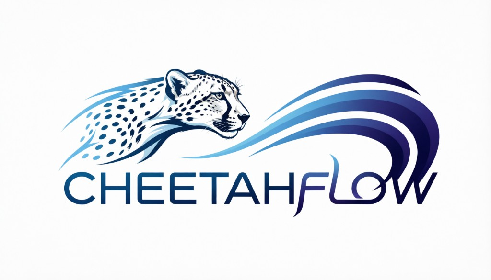

<p align="center">
  
</p>

<h1 align="center">CheetahFlow Orchestrator</h1>

<p align="center">
  Self-hosted <strong>control plane</strong> for multi-agent development workflows: dashboard + API + PostgreSQL/SQLite + Langfuse observability.
</p>

<p align="center">
  <a href="LICENSE"></a>
</p>

---

## Tool versions

| Tool | Version | Where |
|------|---------|--------|
| **Node** | **20.x** | `frontend/.nvmrc`, `.node-version` |
| **pnpm** | **9.15.x** | `packageManager` in `package.json` |
| **Python** | **≥ 3.11** | `backend/pyproject.toml` |
| **uv** | pinned | `backend/uv.lock` |

## Quick start (SQLite — no Docker needed)

```bash
cp .env.example backend/.env
# Edit backend/.env: set CHEETAHFLOW_ADMIN_TOKEN

# Backend
cd backend
uv sync --extra dev
uv run alembic upgrade head
uv run uvicorn agentflow.main:app --reload --host 127.0.0.1 --port 8000
```

Frontend (from repo root):

```bash
pnpm install
pnpm dev   # → http://localhost:3001
```

API docs: `http://127.0.0.1:8000/docs` — all endpoints require header `X-Admin-Token`.

**Dashboard:** open `http://localhost:3001` → **Projects** for per-project Kanban boards; **Agents** for model/instruction configuration. Board auto-refreshes every ~10s for agent-driven moves.

## Quick start (PostgreSQL + Langfuse)

```bash
cp .env.example .env
# Edit .env: uncomment Postgres URL, set Langfuse keys

# Postgres only
docker compose up -d postgres

# Postgres + full Langfuse stack (ClickHouse, Redis, MinIO)
docker compose --profile langfuse up -d
# Langfuse UI → http://localhost:3100
```

Default Langfuse dev credentials (set in `.env`):

| Field | Value |
|---|---|
| URL | http://localhost:3100 |
| Email | admin@cheetahflow.local |
| Password | admin-local-dev |

## Environment variables

| Variable | Required | Description |
|---|---|---|
| `CHEETAHFLOW_DATABASE_URL` | Yes | SQLAlchemy URL — SQLite or Postgres |
| `CHEETAHFLOW_ADMIN_TOKEN` | Yes | Value for `X-Admin-Token` header |
| `OPENROUTER_API_KEY` | Phase B | OpenRouter API key |
| `LANGFUSE_SECRET_KEY` | Optional | Enables Langfuse tracing |
| `LANGFUSE_PUBLIC_KEY` | Optional | Enables Langfuse tracing |
| `LANGFUSE_BASE_URL` | Optional | Langfuse URL (default: cloud.langfuse.com) |
| `NEXT_PUBLIC_API_URL` | Frontend | Backend base URL |
| `NEXT_PUBLIC_ADMIN_TOKEN` | Frontend | Admin token for browser calls |

## Backend commands

```bash
cd backend

uv run pytest                          # tests
uv run pytest --cov=agentflow          # with coverage
uv run ruff check .                    # lint
uv run mypy agentflow/                 # type check

uv run alembic revision --autogenerate -m "describe change"  # new migration
uv run alembic upgrade head                                   # apply migrations
```

## Project structure

```
backend/
  agentflow/
    config.py          # all settings (env vars)
    auth.py            # X-Admin-Token dependency
    observability.py   # Langfuse init + @observe helper
    main.py            # FastAPI app + lifespan
    api/               # one file per resource
    db/                # SQLAlchemy models + session
    schemas/           # Pydantic v2 schemas
    adapters/          # executor adapters (openrouter, claude_code)
    orchestration/     # workflow runner
  alembic/             # migrations
  tests/

frontend/
  src/
    app/               # Next.js App Router pages
    components/        # shared UI components
    lib/api.ts         # typed API client

assets/                # logo and static assets
docker-compose.yml     # postgres (default) + langfuse (--profile langfuse)
AGENTS.md              # guide for AI coding agents
```

## Contributing

See [CONTRIBUTING.md](CONTRIBUTING.md).

## License

[MIT](LICENSE) © 2026 Albert Zagrajek
